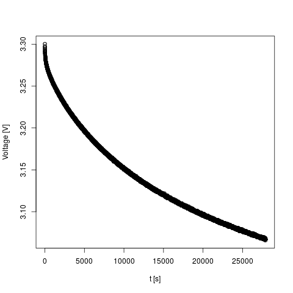

# What is Low-Energy-Meter?

Low-Energy-Meter is a tool for measuring the energy consumption of low-energy devices using a Raspberry Pi. In particular, it was developed to measure the energy consumption of battery-powered Bluetooth Low Energy (BLE) devices.

Low-energy devices switch frequently between active mode and power-save mode striving for minimum duty cycles. The energy consumption differs significantly by several orders of magnitude between active mode and power-save mode (milli-amps vs. micro-amps). This makes energy measurements challenging. For instance, it is hard to dimension a shunt resistor for measuring the voltage drop along the resistor to calculate current as I = V/R. If the shunt resistor is optimized for active mode, the voltage drop will be very low in power-save mode and thus hard to measure. If the shunt resistor is optimized for power-save mode, the voltage drop will be very large in active mode, and the device only runs at significantly reduced voltage possibly dropping below the threshold where brownout reset engages. 

Therefore, we use a different method to measure the energy consumption. We use a large capacitor (C = 10000 uF) as power supply. The energy stored in a capacitor can be calculated as E = 0.5\*C\*V^2. Thus, knowing the time period (t) that it takes to drop from a certain initial voltage (V_upper) to a certain lower voltage (V_lower), we can calculate the energy consumed in period t as E_delta = 0.5\*C\*(V_upper^2-V_lower^2) and the average power consumption as P_avg = E_delta/t. The energy consumption naturally includes the energy spent in active mode as well as power-save mode. So the basic idea is to first charge the capacitor from a "real" power supply (voltage regulator of the Raspberry Pi) and then discharge the capacitor via the device under test. While discharging, we periodically measure the voltage of the capacitor. When the voltage drops below a certain threshold somewhere above the critical brownout detection threshold, we automatically charge the capacitor again and start a new measuring cycle. 

One might argue that the capacitor is prone to self-discharging. However, experiments showed that this effect is very small, even smaller than the energy consumption in power-save mode and much smaller than the energy consumption in active mode, and thus negligible for our purpose. TODO: Prove this claim.

Low-Energy-Meter consists of two parts:

* Measurement hardware connected to the Raspberry Pi. The measurement hardware is basically a circuit board (PCB) with an analog-to-digital converter (ADC), the 10000 uF supply capacitor and some more components to support automatic measurements by repeatedly charging the supply capacitor and sampling the capacitor voltage while discharging the capacitor. The measurement board is depicted in the images below with a simple resistor connected as load ("device under test"). Schematics and PCB layout of the PCB are included.
* Software for the Raspberry Pi that automates the process of charging and sampling the supply capacitor and logging samples to the SD card.


# The Hardware: Measurement Board

We use a capacitor of 10000 uF to power the device under test. This is large enough to run a BLE device for several minutes (using reasonable power-saving techniques) while voltage drops from say 3.0 V to 2.0 V. This capacitor is charged via a 160 Ohm resistor making sure not to overload the 3.3 V power rail of the Raspberry Pi. Since we charge the capacitor from the 3.3 V rail, 3.3 V is the maximum voltage we can supply to the device under test. For the BLE target devices and most MCUs this is a suitable voltage.
 
The measurement board is connected to a Raspberry Pi Model B (a single core Pi is good enough for 1 kHz sampling rate). It includes a 12 bit ADC (MCP6008 or MCP6004) to sample the voltage of the supply capacitor and transmit voltage samples to the Raspberry Pi via SPI.

Moreover, it includes two relays, one for charging the capacitor and powering the device under test while charging, and one for connecting the supply capacitor to the device under test when the capacitor has been charged for measuring the energy consumption. Both relays are controlled from two GPIOs of the Raspberry Pi to automate the process of charging and sampling while discharging the capacitor. An ULN2803 is used to drive the relays. 

A precise 2.5 V voltage reference (LM385) is used as reference for the ADC.

The board layout is optimized for simple etching (alternatively, you can send the Gerber files to a PCB manufacturer of your choice). Moreover, we only use easily available standard components. 

# The Software

Low-Energy-Meter includes a command line tool to automate the process of charging and sampling the supply capacitor and logging samples to a file.

The software tool called low-energy-meter can be found in folder src. 

## Compiling Low-Energy-Meter Tool

As a prerequisite, you need the [bcm2835 library](http://www.airspayce.com/mikem/bcm2835/). After installing the library, you can compile the tool with the following command:

    $ make low-energy-meter

## Running Low-Energy-Meter Tool

For precise sampling intervals, we recommend to use the RTPREEMPT patch for Linux (instructions on how to compile an RTPREEMPT kernel can be found on [this web-site](http://www.frank-durr.de/?p=203). 

The command line tool uses the following arguments:

* ```-f SAMPLING_FREQUENCY```: Sampling frequency. 1 kHz seems to be a safe upper bound where the Raspberry Pi can still deterministically meet the 1 ms sampling interval.
* ```-o FILE```: Output file for logging samples.
* ```-l THRESHOLD_LOWER```: Lower voltage threshold (ADC count) defining when the supply capacitor is recharged.
* ```-u THRESHOLD_UPPER```: Upper threshold (ADC count) defining when a discharging (sampling) cycle starts.

ADC counts can be translated to voltage thresholds as follows: V = 5.0 V \* 4095/ADCCount

Note that the reference voltage of the ADC is 2.5 V and we divide the voltage sampled by the ADC by 2 to stay within the allowed voltage range of max. 2.5 V. Therefore, an ADC count of 4095 corresponds to 5 V.  
    
The format of the output file is CSV (comma-separated values) with the following values per sample: 

* Timestamp of the sample in nanoseconds.
* Epoch (discharging cycle). Measurements are only recorded while discharging, i.e., while powering the device under test from the capacitor.
* ADC count, which can be translated to capacitor voltage by calculating V = 5.0 V \* 4095/ADCCount.

# Measurement Example

The following example shows how to take measurements, and how to evaluate them using [R](https://www.r-project.org/). In this example, we measure the energy-efficiency of the [Faros]() Bluetooth Low Energy Beacon implementing Google's Eddystone standard. The data of this experiment is available in folder data. 

## Step 1: Taking measurements

We take measurements with 1000 Hz sampling frequency, and lower and upper voltage thresholds of 2.0 V (ADC count = 2.0 V / 5.0 V \* 4095 = 1638) and 3.2 V (ADC count = 2621), respectively, i.e., the device under test is running from voltages in this range. The Faros beacon can be operated down to 1.8 V, so re-charging the capacitor at 2.0 V leaves enough headroom to ensure that the beacon will not reset. We also provide the data set of this experiment in folder data, so you can follow the steps below.

    $ sudo ./low-energy-meter -f 1000 -l 1638 -u 2621 -o faros.csv -p 80

## Step 2: Loading the CSV data into R.

    $ R
    $ x <- read.csv(file="faros.csv",head=FALSE,sep=",")

After this step, you will find all data in data frame x, which is basically a table with three rows called x$V1 (timestamp in nanoseconds), x$V2 (measurement cycle), and x$V3 (ADC count of voltage measurements).

## Step 3: Selecting data for evaluation

We will select data from one measurement cycle in a certain voltage range between 2.0 V (ADC count 1638) and 3.0 V (ADC count 2457).

    $ y = subset(x, x$V2==2 & x$V3 >= 1638 & x$V3 <= 2457)

The selected data is now in data frame y. For visual inspection, you can plot the voltage (ADC counts) over time using the following command:

    $ plot(y$V1/1000000000-min(y$V1)/1000000000, y$V3/4095*5.0, xlab="t [s]", ylab="Voltage [V]")

The following plot shows the measurements taken for the Faros beacon.


## Step 4: Calculating consumed energy and average power consumption

First, we determine the maximum and minumum voltage of the selected sample interval:

    $ max(y$V3)
    [1] 2457
    $ min(y$V3)
    [1] 1638

So the maximum and minumum voltages are V_max = 2457/4095 \* 5.0 V = 3.0 V and V_min = 1638/4095 \* 5.0 V = 2.0 V, respectively.

Then, we calculate the time t that it took to drop from V_max to V_min:

    $ (max(y$V1)-min(y$V1))/1000000000
    151.715
 
So it took t = 151.715 s.

Since we know the capacity of the supply capacitor (10000 uF), we can calculatete the energy spent in this time interal as:

E = 0.5\*10000 uF\*(3.0 V)^2 - 0.5\*10000 uF\*(2.0 V)^2 = 0.025 J

The average power consumption is then calculated as:

P_avg = E/t = 0.025 J / 151.715 s = 164.78 uW

So if the Faros BLE beacon is powered from AA-size batteries (two connected in series to provide a nominal voltage of 3.0 V) with say 2.60 Wh energy, the beacon could run for about 657 days or 1.8 years.

# Voltage Leakage

One might argue that this measurement method is prone to inaccuracies because of self-discharging effects, bias current flowing into or out of the opamp connected to the capacitor (which according to the datasheet of the MCP6001 should be in the order of pA, so possibly not the biggest effect), etc. In order to evaluate these undesired effects, we took measurements without any load connected, where we would expect (ideally) the power consumption to be zero. The data is included in the data folder. The figure below depicts the result.

We can see that the capacitor discharged from initially V_max = 3.300 V to V_min = 3.066 V over a time period of t = 27926 s = 7.76 h. Hence, the energy consumed in this period is 0.0074 J, and the average power consumption is 266.713 nW. So giving some safety-margin, we can assume an accuracy of power measurements of about 1 uW. 



# Limitations

This measurement method is targeting low-energy devices, in particular, BLE devices. We make the following assumptions:

* The device under test can run from varying voltages in a range from 3.3 V to some lower threshold. Typical lower thresholds of MCUs used in BLE devices are as low as 1.8 V. For devices requiring more than 3.3 V (like for instance a Raspberry Pi, which is powered from 5.0 V USB), the circuit is not suitable.
* The device under test consumes little power up to tens of milliamps over the desired voltage range. Otherwise, the supply capacitor does not provide enough energy to run the device for a longer period including all operational modes (active and power-save mode). Up to tens of milliamps are typical values for active BLE devices with active MCU and radio (in power-save mode, the current is much lower down to micro-amps).    

# Licensing

Low-Energy-Meter uses two licenses for open hardware and software, respectively:

* The software (source code) is licensed under the Apache License 2.0
* The hardware (schematic diagrams, circuit board layouts, hardware documentation) is licensed under the CERN Open Hardware Licence v1.2

Both licenses are included in the repository.